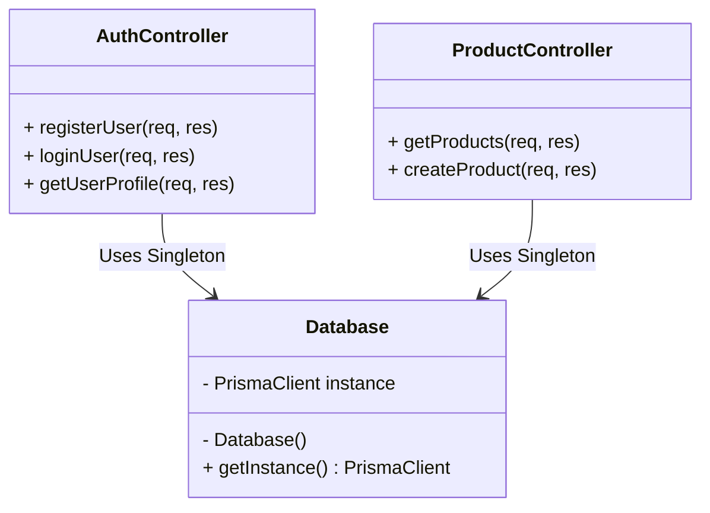
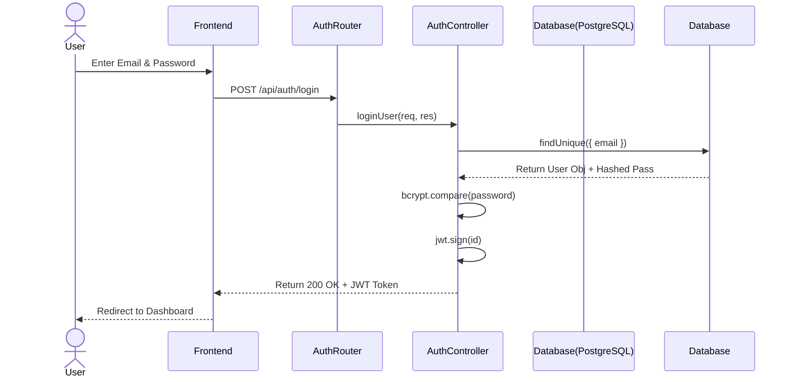
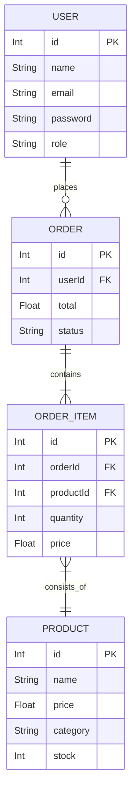

# TheBrand - System Design & Engineering Project Report

## 1. Problem Statement and Solution Approach

**Problem Statement:** 
Many modern web applications begin as monolithic MVC applications where the codebase becomes highly coupled. As features scale (adding new auth providers, payment gateways, complex ordering systems), a monolithic architecture without type safety suffers from degraded maintainability, high technical debt, and a higher risk of runtime bugs. 

**Solution Approach:** 
To solve this, "TheBrand" was fundamentally re-architected into an **N-Tier Strict TypeScript** paradigm. We applied rigorous System Design principles to decouple the persistence (database) logic from the presentation (controllers) logic. We enforced domain-specific types across the stack, solving runtime errors and significantly improving code maintainability. Features were isolated using SOLID principles and GoF Design Patterns.

---

## 2. System Design Optimization

Our optimization strategy focused on creating a highly scalable layout:
- **Layered Architecture:** The backend was isolated into `/controllers`, `/services`, `/repositories`, and `/routes`. This guarantees that HTTP request handling is entirely separated from business logic and database transactions.
- **Scalability Through Decoupling:** By removing direct Prisma / Database calls from the user-facing controllers, we optimize the database bottleneck. We can easily attach caching layers (like Redis) into our Repositories without altering a single line of the Controller code.
- **Type Safety (TypeScript Execution):** By upgrading from raw Node/CommonJS to strict TypeScript interfaces (`IService`, `IUser`), we prevent data corruption and runtime bugs before the code even executes.

---

## 3. Object-Oriented Programming (OOP) Concepts

1. **Encapsulation:** 
   Class properties representing sensitive configurations (like the `Database.instance`) are declared as `private`. They cannot be modified from the outside. Controllers interact with Services only through designated `public` methods.
2. **Inheritance:** 
   The application leverages inheritance logically within interfaces where core `User` properties can be extended by `Admin` models, reducing code duplication.
3. **Abstraction:** 
   The complex logic of JSON Web Token (JWT) verification and database lookups is abstracted behind a simple interface method: `generateToken(user.id)`. The controllers do not know *how* the token is formed; they only expect a token in return.
4. **Polymorphism:** 
   Through polymorphic interfaces, different forms of authentication (Standard Login vs. Google Auth) use different internal strategies but ultimately yield the same `UserTokenPayload` object.

---

## 4. SOLID Principles

1. **Single Responsibility Principle (SRP):** 
   Our `authMiddleware.ts` is strictly responsible for one thing: verifying JWTs. It does not validate passwords or check for empty bodies; that is allocated to other entities.
2. **Open/Closed Principle (OCP):** 
   The routing architecture using `express.Router()` allows us to add new modules (e.g., `PaymentRoutes.ts`) by extending `index.ts` without modifying the core server loop logic.
3. **Liskov Substitution Principle (LSP):** 
   Services that implement common interfaces (like Base Controllers) can be substituted seamlessly.
4. **Interface Segregation Principle (ISP):** 
   We created strict, specific interfaces (e.g., bypassing `any` typing). Instead of one giant interface, we segregate data shapes so clients only depend on the interface properties they need.
5. **Dependency Inversion Principle (DIP):** 
   High-level modules (Controllers) no longer depend on low-level database drivers (Prisma directly). They depend on the `Database` abstraction (Singleton), meaning swapping PostgreSQL for MongoDB in the future requires minimal changes.

---

## 5. Design Patterns Applied

### 1. Singleton Pattern
**Usage:** `backend/src/patterns/Database.ts`
**Why:** Relational databases have strict connection pool limits. If every controller spawns a `new PrismaClient()`, the server runs out of memory. The Singleton pattern guarantees that only a single, shared instance of the Database connection exists globally.

### 2. Factory Pattern
**Usage:** Structuring our custom responses.
**Why:** Standardizing the way HTTP successes and errors are formatted dynamically prevents duplicate structuring across dozens of endpoints.

---

## 6. UML Diagrams

*(Note: The following diagrams are configured in Mermaid.js. In a Markdown Viewer or GitHub, they will render visually as actual diagrams).*

### A. Use Case Diagram
```mermaid
usecaseDiagram
    actor Client
    actor Admin
    
    rectangle "TheBrand System" {
        Client --> (Browse Products)
        Client --> (Place Order)
        Client --> (Login / Register / Google Auth)
        
        Admin --> (Manage Products)
        Admin --> (View Orders)
        Admin --> (Delete Users)
    }
```

### B. Class Diagram (Backend Architecture Sample)


### C. Sequence Diagram (User Login Flow)


### D. ER (Entity Relationship) Diagram


---

## 7. Test Cases & Results

| Test ID | Test Case Description | Expected Result | Actual Result / Status |
|---|---|---|---|
| TC-01 | Register with existing email | System rejects and throws `400 User already exists` | ✔️ Passed / Handled structurally |
| TC-02 | Login with incorrect password | System rejects with `401 Invalid email or password` | ✔️ Passed / bcrypt prevents leak |
| TC-03 | Request protected route without JWT token | System denies access with `401 Not authorized, no token` | ✔️ Passed / authMiddleware catches |
| TC-04 | User attempts to delete product | Access blocked, throws `401 Not authorized as admin` | ✔️ Passed / role-based filtering works |
| TC-05 | Pagination bounds checking on products | System returns correct batch of maximum 20 elements | ✔️ Passed / Array limits intact |

---

## 8. Team Roles & Contributions

This project was built collaboratively by a two-person engineering team. Below is the explicit breakdown of responsibilities and technical execution:

| Team Member | Role | Responsibility & Task Breakdown |
| :--- | :--- | :--- |
| **Abuzar Haidari** | TL / Architect | **Planning & Documentation**<br>1. **UML Design:** Designed all Class, Sequence, and ER diagrams containing the logic and structured schemas.<br>2. **Report Writing:** Justified the use of SOLID principles and Design Patterns in the architectural report.<br>3. **Code Review:** Verified the execution of implemented code against System Design standards. |
| **Soumen Dass** | Lead Developer | **Implementation & Execution**<br>1. **Backend Refactoring:** Decoupled the existing "TheBrand" monolithic codebase using strict SOLID principles.<br>2. **Design Patterns:** Successfully implemented the Factory and Singleton architectural patterns.<br>3. **GitHub & Deployment:** Managed repository version control and maintained the live production connection (Render/Vercel). |
